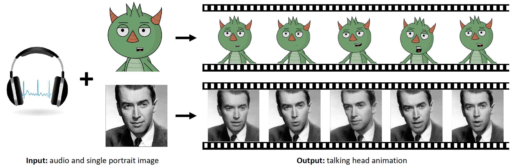

# Demo: MakeItTalk

[Project page](https://people.umass.edu/~yangzhou/MakeItTalk/) |
[Paper](https://people.umass.edu/~yangzhou/MakeItTalk/MakeItTalk_SIGGRAPH_Asia_Final_round-5.pdf) |
[Video](https://www.youtube.com/watch?v=OU6Ctzhpc6s) |
[Arxiv](https://arxiv.org/abs/2004.12992)



## 輸出範例

<p float="left">
  
   
</p>
<p float="left">
  
   
</p>

## 限制

### Technical Limitation

- 最大輸出解析度：256x256
- 最大時長：無限制
- 輸出影片幀率：22 fps

### Quality

- 輸入中文嘴型準確度較差，推測是跟訓練模型用的dataset有關
- 背景內容較複雜時容易看出扭曲
- 正臉效果較佳，推測與訓練用dataset跟人臉標記重疊有關

### 適用場合

- 正臉，臉部特徵（特別是嘴形）容易辨識、背景簡單
- 新聞播報、線上教學、演說、訪談等人只需露出肩部以上且沒有太大移動的說話情境

### 測試硬體規格

- OS：Ubuntu 20.04
- GPU：NVIDIA GeForce® RTX 2070 SUPER
- GPU Memory：8 GB
- Memory：32 GB
- CUDA Driver：470.82.00
- CUDA：11.4
- cuDNN：8.x.x
- Python version(local)：3.8.10
- Python version(docker)：3.6.9

### 實際硬體用量

- 模型大小（GPU）：986.6 MB
- GPU 記憶體用量：5 GB（4877 MB）
- Inference 所需時間
    |    | 輸入聲音長度  |  花費時間 |
    |--- |---|---|
    |1   |  4s |  11.7s |
    |2   | 8s  |  17.6s |
    | 3  | 9s  |  17.9s |
    | 4  |  17s| 27.8s |


## Pre-trained Models

Download the following pre-trained models to `examples/ckpt` folder for testing your own animation.

| Model |  Link to the model | 
| :-------------: | :---------------: |
| Voice Conversion  | [Link](https://drive.google.com/file/d/1ZiwPp_h62LtjU0DwpelLUoodKPR85K7x/view?usp=sharing)  |
| Speech Content Module  | [Link](https://drive.google.com/file/d/1r3bfEvTVl6pCNw5xwUhEglwDHjWtAqQp/view?usp=sharing)  |
| Speaker-aware Module  | [Link](https://drive.google.com/file/d/1rV0jkyDqPW-aDJcj7xSO6Zt1zSXqn1mu/view?usp=sharing)  |
| Image2Image Translation Module  | [Link](https://drive.google.com/file/d/1i2LJXKp-yWKIEEgJ7C6cE3_2NirfY_0a/view?usp=sharing)  |
| Non-photorealistic Warping (.exe)  | [Link](https://drive.google.com/file/d/1rlj0PAUMdX8TLuywsn6ds_G6L63nAu0P/view?usp=sharing)  |

## 安裝方法 (docker)

- 在 host 上安裝 Docker and NVIDIA Container Toolkit 以使用 GPU-enabled docker.
- 如果欲使用 CUDA 和 GPU，確認 host 的 CUDA driver 是否支援 CUDA 11.1，如果不支援，可以使用較低版本的 CUDA image，另外修改安裝的 torch 版本。
- Build the image with `docker build -t makeittalk:latest .`
- Run the container with `docker run -it --gpus all makeittalk:latest bash`

## Test Model

- 進入 `./src`
- 將圖片（256*256）放入 `src/examples`。
- 將音檔放入 `src/examples`（讓 `src/examples` 內只有一個.wav檔）
- Run `python main_end2end.py --jpg <portrait_file.jpg>` .

## MakeItTalk API Service

### Run MakeItTalk API Service Locally
- 使用 API service 之前先建立 [Cloudinary](https://cloudinary.com) 帳號。

- Install packages
  ``` bash
  $ cd src

  $ pip install -r requirement.txt
  ```

- Set [Cloudinary](https://cloudinary.com) environment variables

  ``` bash
  $ export CLOUDINARY_API_KEY='123451234512345'
  $ export CLOUDINARY_API_SECRET='AsdfghjklAsdfghjklAsdfghjkl'
  $ export CLOUDINARY_CLOUD_NAME='mycloud123'
  ```
- Run API service locally
  ```bash
  $ uvicorn main:app --host 0.0.0.0 --port 8080 bash
  ```

### Run MakeItTalk API Service in Docker
- Use the image `makeittalk:latest` built in previous part.

  ```bash
  $ docker run --gpus all -p 127.0.0.1:8080:80 -it makeittalk:latest bash

  root@9b3825bb8d5d:/work/src$ export CLOUDINARY_API_KEY='123451234512345'
  root@9b3825bb8d5d:/work/src$ export CLOUDINARY_API_SECRET='AsdfghjklAsdfghjklAsdfghjkl'
  root@9b3825bb8d5d:/work/src$ export CLOUDINARY_CLOUD_NAME='mycloud123'
  root@9b3825bb8d5d:/work/src$ uvicorn main:app --host 0.0.0.0 --port 80
  ```

### API Usage

<table>
    <tbody>
        <tr>
            <td>URL</td>
            <td>HTTP Method</td>
            <td>Request</td>
            <td>Response</td>
        </tr>
        <tr>
            <td>/audio2vid</td>
            <td>POST</td>
            <td>{
              "audio": String,
              "image": String
            }</td>
            <td>{
              "output_url": String
            }</td>
        </tr>
    </tbody>
</table>

### API Usage Example

```JSON
// sample input
{
  "audio": "https://your.audio/audio.wav",
  "image": "https://your.image/image.jpg"
}
// sample output
{
  "output_url": "http://res.cloudinary.com/mycloud123/video/upload/v0123456789/makeittalk-outputs/rhuifh83hf4xnf8944j3.mp4"
}
```

## [License](src/LICENSE.md)

## Acknowledgement

We would like to thank Timothy Langlois for the narration, and
[Kaizhi Qian](https://scholar.google.com/citations?user=uEpr4C4AAAAJ&hl=en) 
for the help with the [voice conversion module](https://auspicious3000.github.io/icassp-2020-demo/). 
We thank [Jakub Fiser](https://research.adobe.com/person/jakub-fiser/) for implementing the real-time GPU version of the triangle morphing algorithm. 
We thank Daichi Ito for sharing the caricature image and Dave Werner
for Wilk, the gruff but ultimately lovable puppet. 

This research is partially funded by NSF (EAGER-1942069)
and a gift from Adobe. Our experiments were performed in the
UMass GPU cluster obtained under the Collaborative Fund managed
by the MassTech Collaborative.


